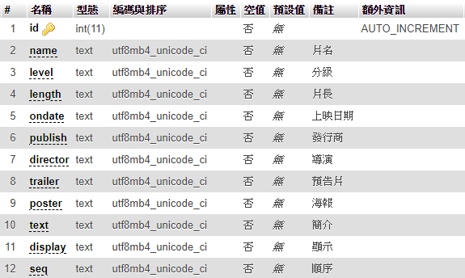
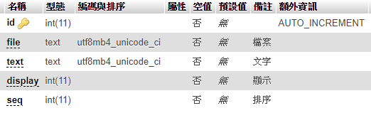
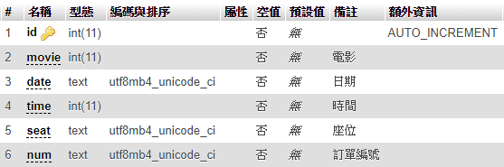

# 建立資料庫

這題資料庫沒有需要特別注意的地方，只有電影的資料欄位有點多而已  
這題不用做登入人數，也不需要建立管理員和會員資料庫，因為題目只有一位管理員登入，判斷寫死就好  

## 院線片
新增`movie`資料表，儲存院線片資料  

- `id`為AUTO\_INCREMENT的流水號
- `name`為片名
- `level`為分級
- `length`為片長
- `ondate`為上映日期
- `publish`為發行商
- `director`為導演
- `trailer `為預告片
- `poster`為海報
- `text`為簡介
- `display`為是否在前台顯示
- `seq`為顯示順序

## 預告片

新增`post`資料表，儲存預告片海報  

- `id`為AUTO\_INCREMENT的流水號
- `file`為檔名
- `text`為簡介
- `display`為是否在前台顯示
- `seq`為顯示順序

## 預告片動畫

新增`ani`資料表，儲存預告片動畫方式  
這邊算是題目的小漏洞，題目並沒有規定各預告片一個動畫效果還是全部同一種效果  
所以用這種方式來減少首頁動畫輪播的程式碼量

## 訂票

新增`orders`資料表，儲存訂票資料  

- `id`為AUTO\_INCREMENT的流水號
- `movie`為電影ID
- `date`為日期
- `time`為時段
- `seat`為座位
- `num`為訂單編號
  

